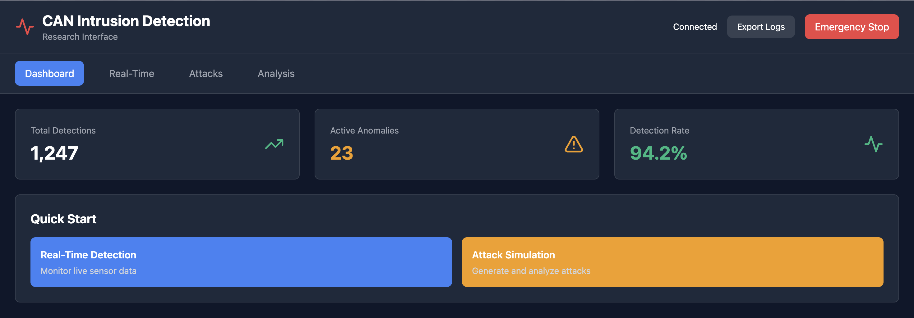
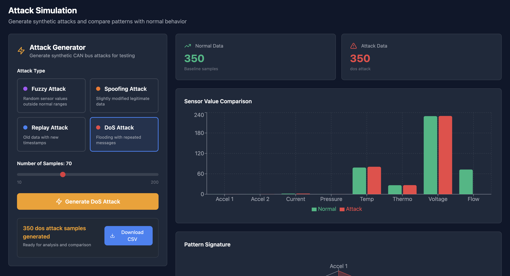

# CAN Intrusion Detection System

A web-based platform for real-time anomaly detection in automotive Controller Area Network (CAN) bus data, designed to support research in operator decision-making and explainable AI systems.

**Version:** 2.0.0  
**Status:** Active Development  
**License:** MIT


---

## Overview

This project reimagines traditional intrusion detection systems by focusing on the human operator experience. Rather than simply flagging anomalies, the system provides interactive explanations, comparative model analysis, and visual tools to help operators understand and trust automated decisions.

Built as a complete architectural redesign from a previous Streamlit implementation, this version separates concerns into a FastAPI backend and React frontend, enabling more sophisticated interaction patterns and research-oriented features.

---

### Interface & Analysis Visuals

**System Dashboard (Real-Time Monitoring)**  
Live sensor readings, anomaly indicators, and system connectivity status.



---

## Core Features

### Real-Time Monitoring
Monitor live CAN bus sensor data with immediate anomaly detection using One-Class Support Vector Machines. The interface updates every two seconds, displaying eight sensor readings simultaneously with color-coded status indicators.

Key capabilities:
- Adjustable detection sensitivity via threshold slider
- Interactive timeline visualization showing anomaly patterns over time
- Click-to-explain functionality revealing which sensors contributed to each detection
- Live statistics tracking detection rates and model confidence


### Attack Simulation
Generate synthetic attack patterns to understand how different intrusion types manifest in sensor data. Supports four attack categories:
- Fuzzy attacks (random sensor values)
- Spoofing attacks (subtly modified legitimate data)
- Replay attacks (old data with current timestamps)
- Denial-of-service patterns (message flooding)

Each generated attack can be compared against normal traffic patterns through side-by-side visualizations and exported as CSV for offline analysis.



### Multi-Model Analysis
Compare three different detection approaches on identical data:
- SVM provides instant single-point analysis
- LSTM Autoencoder examines temporal patterns across ten sequential readings
- Battery-specific LSTM focuses on voltage anomalies

The system highlights when models disagree, creating opportunities to study how operators resolve conflicting automated advice.


### 3D Spatial Visualization
Explore sensor readings in three-dimensional space using WebGL rendering. Normal and anomalous data points cluster differently in this representation, with interactive camera controls allowing free exploration. New data points pulse briefly when added during live streaming.


---

## Technical Architecture

### Backend Stack
- Python 3.12
- FastAPI web framework
- TensorFlow 2.17 for neural network models
- Scikit-learn for SVM implementation
- Pandas and NumPy for data processing

### Frontend Stack
- React 18 with Vite build tool
- Tailwind CSS for styling
- Zustand for state management
- Recharts for 2D data visualization
- Three.js with React Three Fiber for 3D graphics
- Axios for HTTP requests

### Machine Learning Models
Three pre-trained models work in parallel:
1. One-Class SVM trained on normal traffic patterns
2. LSTM Autoencoder learning temporal sequences
3. Specialized LSTM for battery voltage monitoring

All models include feature importance calculations to support explainability.

---

## Installation

### Requirements
- Python 3.12 (or 3.9-3.12)
- Node.js 16 or higher
- 4GB RAM minimum
- Modern web browser with WebGL support

### Backend Setup

```bash
cd backend

# Create virtual environment
python3.12 -m venv venv
source venv/bin/activate  # Windows: venv\Scripts\activate

# Install dependencies
pip install -r requirements.txt

# Verify structure
ls models/  # Should contain: battery.h5, lstm_autoencoder.h5, scaler.pkl
ls data/    # Should contain: CAN.csv
```

### Frontend Setup

```bash
cd frontend

# Install dependencies
npm install

# Verify configuration
ls src/components/  # Should contain: realtime/, attacks/, analysis/
```

---

## Running the Application

Start both servers in separate terminal windows:

**Terminal 1 - Backend:**
```bash
cd backend
source venv/bin/activate
python app.py
```
Server starts at `http://localhost:8000`

**Terminal 2 - Frontend:**
```bash
cd frontend
npm run dev
```
Interface opens at `http://localhost:3000`

Navigate to the frontend URL in your browser. The header should show "Connected" when the backend is reachable.

---

## Usage Guide

### Getting Started
1. Open `http://localhost:3000` in your browser
2. Navigate to the Real-Time tab
3. Click "Start Stream" to begin data collection
4. Observe sensor readings updating every two seconds

### Investigating Anomalies
When the system detects an anomaly (red dot on timeline):
1. Click the red dot or the "Explain" button
2. Review the modal showing which sensors deviated from normal
3. See contribution percentages and z-scores for each feature
4. Close the modal to continue monitoring

### Comparing Detection Models
1. Collect at least 10 readings via streaming
2. Navigate to the Analysis tab
3. Switch to "Model Comparison" view
4. Click "Run Comparison" to see how all three models evaluate the same data
5. Review the agreement analysis to understand model consensus

### Simulating Attacks
1. Navigate to the Attacks tab
2. Select an attack type
3. Adjust sample count as needed
4. Click "Generate" to create synthetic attack data
5. Review comparison charts showing attack versus normal patterns
6. Use "Download CSV" to export data for further analysis

### Exporting Research Data
Click "Export Logs" in the header to download a JSON file containing all user interactions during the session. This file includes timestamps, events, and relevant context for each action.

---

## Project Structure

```
CAN-Intrusion-Detection/
├── backend/
│   ├── app.py                 # FastAPI application
│   ├── requirements.txt       # Python dependencies
│   ├── models/               # ML model implementations
│   ├── schemas/              # Request validation
│   ├── utils/                # Helper functions
│   └── data/                 # Training dataset
├── frontend/
│   ├── package.json          # Node dependencies
│   ├── vite.config.js       # Build configuration
│   ├── tailwind.config.js   # Style configuration
│   └── src/
│       ├── components/       # React components
│       ├── hooks/           # Custom React hooks
│       ├── stores/          # State management
│       └── utils/           # Helper functions
├── assets/                   # Screenshots and examples
└── README.md
```

---

## API Reference

### Check System Health
```http
GET /api/health
```
Returns status of all loaded models.

### Generate Synthetic Attack
```http
POST /api/attacks/generate
Content-Type: application/json

{
  "attack_type": "fuzzy",
  "num_samples": 50
}
```

### Detect Anomaly (SVM)
```http
POST /api/anomaly/detect-svm
Content-Type: application/json

{
  "datetime": 1234567890.0,
  "Accelerometer1RMS": 0.21,
  "Accelerometer2RMS": 0.27,
  "current": 2.70,
  "pressure": 0.05,
  "temperature": 89.38,
  "thermocouple": 28.88,
  "voltage": 224.93,
  "VolumeFlowRateRMS": 126.67
}
```

Response includes anomaly score, detection result, and feature importance rankings.

Interactive API documentation available at `http://localhost:8000/docs` when the backend is running.

---

## Configuration

### Adjust Detection Sensitivity
Edit `backend/models/svm_model.py`, line 47:
```python
prediction = 1 if anomaly_score >= 60 else -1  # Change 60 to adjust threshold
```

### Modify Polling Interval
Edit `frontend/src/App.jsx`, line 12:
```javascript
useRealtimeData(isStreaming, 2000)  // Change 2000 to desired milliseconds
```

### Customize Color Scheme
Edit `frontend/tailwind.config.js`:
```javascript
colors: {
  'anomaly': {
    'critical': '#EF4444',  // Red for high severity
    'high': '#F59E0B',      // Orange for medium
    'low': '#10B981',       // Green for normal
  }
}
```

---

## Research Applications

This system was designed to support studies in several areas:

**Trust Calibration:** Track how operators adjust detection thresholds over time. Do they converge on consistent sensitivity levels? How do false positives influence their calibration behavior?

**Explanation Effectiveness:** Log which anomalies users investigate versus ignore. Does viewing feature importance increase confidence in automated decisions? How do operators respond when the explanation contradicts their intuition?

**Model Comparison:** When models disagree, which does the operator trust more? Does temporal context (LSTM) override instant feedback (SVM)? Are specialized models perceived as more reliable?

**Interface Design:** Compare 2D timeline visualization against 3D spatial representation. Which helps operators identify patterns faster? Does 3D add cognitive load or improve understanding?

The interaction logging system captures events like threshold adjustments, explanation views, model comparisons, and navigation patterns. Export logs as JSON for analysis in statistical software or qualitative coding tools.

---

## Known Limitations

**Model Training:** All models use pre-existing training data and cannot be retrained through the interface. To update models, retrain externally and replace the .h5 files.

**Data Persistence:** Collected readings exist only in browser memory and reset when the page refreshes. Export logs before closing to preserve session data.

**Concurrent Users:** The system runs locally and does not support multiple simultaneous users. Each instance maintains independent state.

**Browser Compatibility:** 3D visualization requires WebGL support. Some older browsers or restrictive security settings may block this feature.

---

## Troubleshooting

**Backend fails to start:**
- Verify Python version: `python --version` (should be 3.9-3.12)
- Check virtual environment is activated
- Ensure all model files exist in `backend/models/`
- Review terminal output for missing dependencies

**Frontend shows "Offline" status:**
- Confirm backend is running on port 8000
- Check for port conflicts: `lsof -i:8000`
- Verify no firewall blocking localhost connections
- Try accessing `http://localhost:8000/api/health` directly

**3D visualization shows black screen:**
- Enable WebGL in browser settings
- Update graphics drivers
- Try a different browser
- Check browser console for specific error messages

**Models return incorrect predictions:**
- Verify model files are not corrupted
- Check that input data matches expected format
- Review scaler.pkl exists and is accessible
- Examine backend terminal for model loading errors

---

## Development Notes

**Adding New Sensors:** Update the schema in `backend/schemas/requests.py` and modify model wrappers to handle additional features. Frontend components will need corresponding updates to display new data.

**Implementing New Models:** Create a detector class following the pattern in `backend/models/`, add an endpoint in `app.py`, and create frontend components to display results.

**Modifying Visualizations:** Chart configurations live in their respective components under `frontend/src/components/`. Recharts and Three.js both support extensive customization through props.

---

## Dataset Information

The system uses CAN bus data containing readings from automotive sensors. Each record includes:
- Timestamp
- Two accelerometer measurements
- Current draw
- Pressure reading
- Temperature (two sensors)
- Voltage
- Volume flow rate

Data originates from normal vehicle operation with no attacks present in the training set. Models learn expected patterns from this baseline to identify deviations.

---

## Contributing

This project welcomes improvements and extensions. To contribute:

1. Fork the repository
2. Create a feature branch
3. Implement changes with clear commit messages
4. Test thoroughly with both frontend and backend
5. Submit a pull request with description of modifications

Focus areas for contribution:
- Additional machine learning models
- Alternative visualization approaches
- Enhanced interaction logging
- Performance optimizations
- Documentation improvements

---

## Assets & Example Outputs

This repository includes visual artifacts and sample datasets used to demonstrate system behavior, model analysis, and attack simulations.

---

### Data Files

**Denial-of-Service Attack Dataset (CSV)**  
Synthetic CAN traffic illustrating message flooding behavior.  
Used for attack simulation and offline analysis.

- 📄 [DOS Attack Data.csv](assets/DOS%20Attack%20Data.csv)

---

**Exported Detection & Interaction Logs (JSON)**  
Structured output capturing detection events, explanations, and system state.  
Suitable for research analysis and reproducibility.

- 📄 [CAN Intrusion Detection Data.json](assets/CAN%20Intrusion%20Detection%20Data.json)

---

### Asset Notes

- All images are screenshots captured from the running application
- CSV and JSON files are exported directly from the system
- Assets support documentation, reproducibility, and qualitative analysis

## Version History

**2.0.0** (Current)
- Complete architectural redesign
- FastAPI backend replacing Streamlit
- React frontend with component-based architecture
- Multi-model comparison feature
- Interactive 3D visualization
- Research-oriented interaction logging

**1.0.0** (Previous)
- Streamlit monolithic application
- MySQL authentication
- Basic SVM and LSTM detection
- Static matplotlib visualizations

---

## License

This project is released under the MIT License. See LICENSE file for details.

Permission is granted to use, modify, and distribute this software for educational and research purposes. Commercial use requires attribution to original authors.